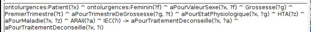

# HTA Onto
HTA Onto est une ontologie construite sous Protégé qui lie les différents concepts utilisés dans le domaine de l’hypertension artérielle avec leurs définitions et les propriétés qui caractérisent les patients. Elle regroupe également les différents diagnostics possibles ainsi que les prises en charge thérapeutiques. L'objectif est son intégration dans une base de connaissances d’un système d’aide à la décision.

## formalisation du raisonnement en SWRL
Un exemple de formalisation du raisonnement en SWRL pour les prises en charge thérapeutiques recommandées d’une patiente (conformément aux recommandations de Vidal) est le suivant :
```
SI HTA + femme pendant la grossesse en 1er trimestre alors IEC + ARA2 déconseilles.

```


